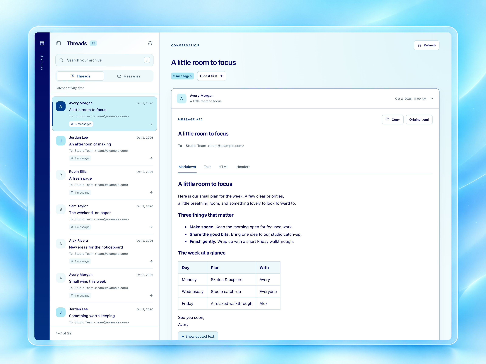
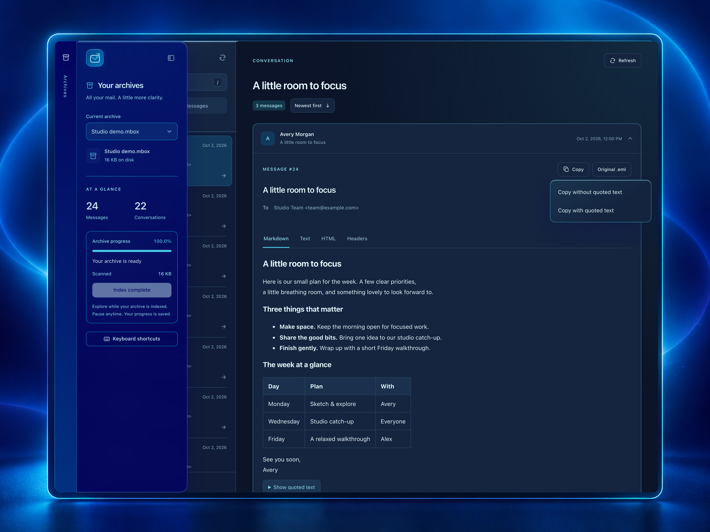
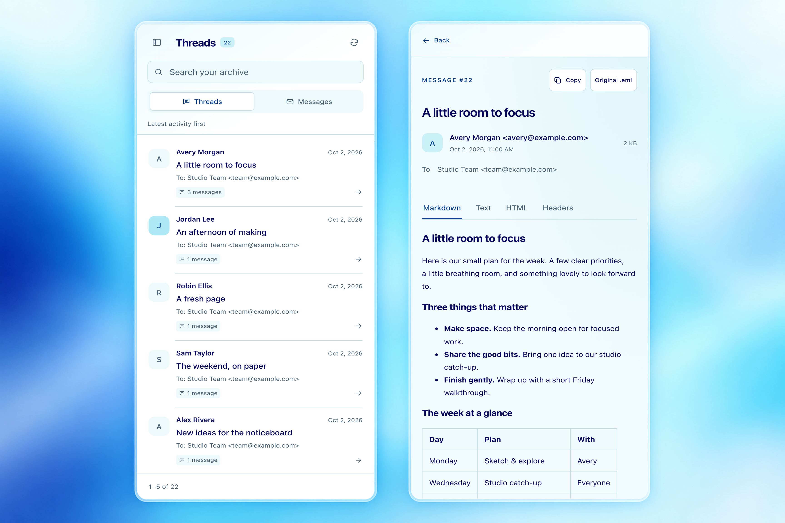
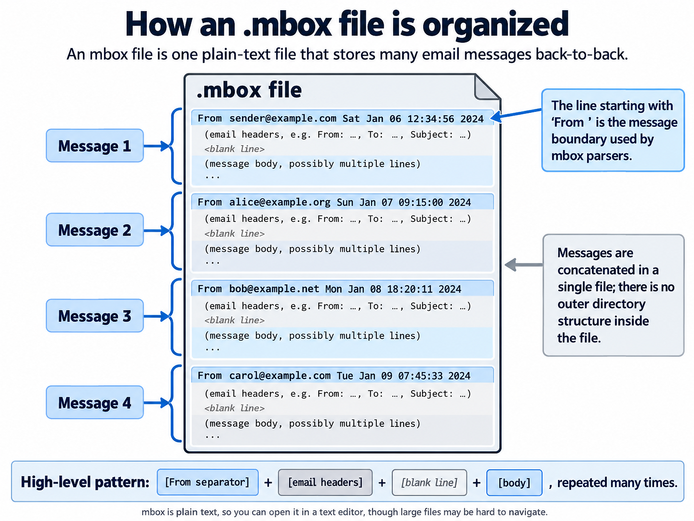
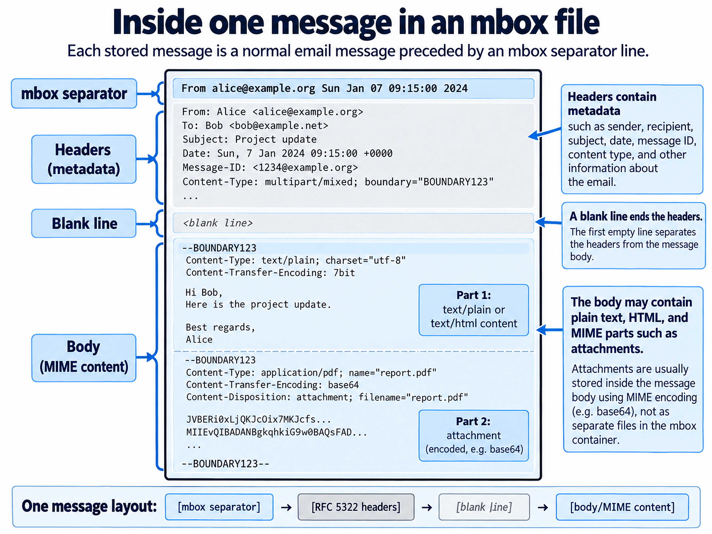
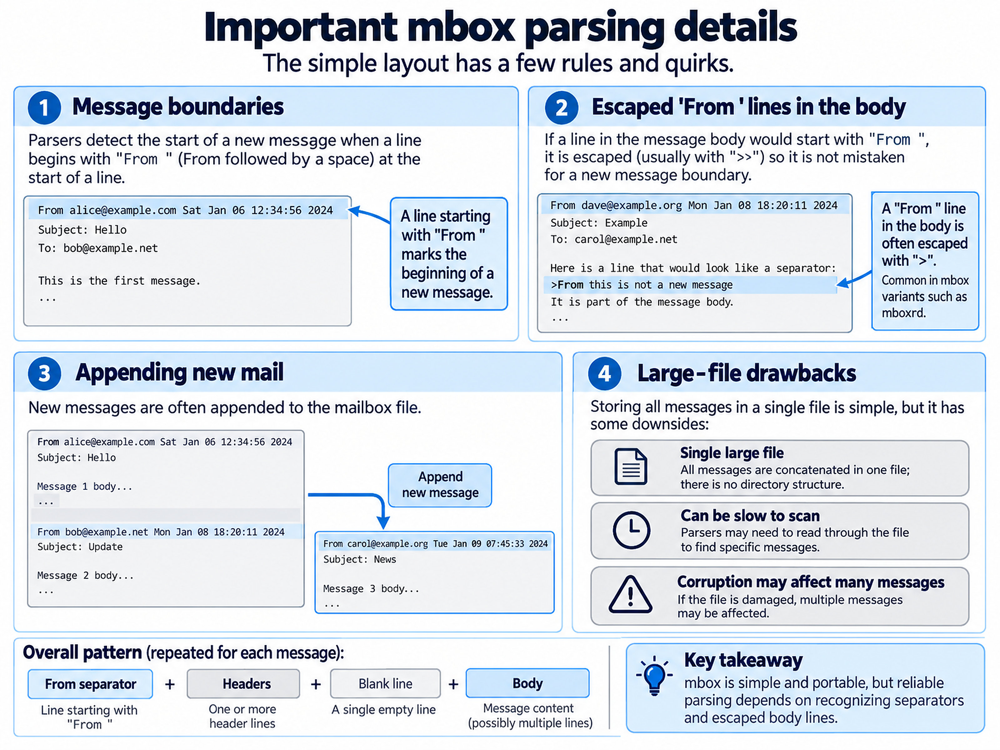

# Mail Explorer

A local FastAPI app for browsing large `.mbox` archives, with a simple mailbox list and reading pane. The example in `mailbox/` is approximately 95 GB; neither startup nor browsing loads that file into memory.



*Light mode with Markdown reading, conversation controls, and collapsed quoted history.*

All pictured messages and people are fictional; email addresses use example domains. The images are high-resolution PNGs. [Image sources, resolutions, and rebuild instructions](docs/images/README.md).

## Run

Requires Python 3.12+ and [uv](https://docs.astral.sh/uv/).

```sh
uv sync
uv run mail-explorer
```

Open **http://127.0.0.1:8000**. The app discovers `.mbox` and `.mbx` files directly inside `mailbox/`. Selecting an archive starts background indexing; messages become available as the scanner finds them. Use **Pause indexing** to stop and **Resume indexing** to continue.

To use another directory or port:

```sh
uv run mail-explorer --mailbox-dir /path/to/archives --port 8001
```

`--cache-dir` changes the index location (default: `.mail-explorer/`). `MAILBOX_DIR` and `MAIL_EXPLORER_CACHE` provide the same defaults through environment variables. `uv run python -m mail_explorer` and `uv run uvicorn mail_explorer.app:app` also work. Run a single server worker against a given cache directory.

## Browse

- Choose an archive. **Threads** groups conversations and sorts them by latest activity; **Messages** shows individual emails in archive order.
- Scroll the message or thread list to load more. The footer shows the visible range; earlier rows load again when you scroll back.
- Open a thread to see its messages, oldest first by default. Use the sort toggle beside the message count to switch between **Oldest first** and **Newest first**. Changing order starts at the first page, and your choice stays selected as you open other threads. Expand a message to read it. One body stays open at a time, and long conversations have paginated message lists. Use the conversation's **Refresh** button to pick up replies indexed since you opened it.
- Search subjects, senders, and recipients. Search uses word prefixes; `pric` matches `pricing`, and multiple words must all match. In Threads view, a match in any message brings up the conversation. Search covers the indexed portion of the archive, with more results available as indexing advances.
- Emails open in **Markdown** by default, with **Text**, **HTML**, and **Headers** tabs alongside it. Markdown preserves headings, emphasis, lists, tables, code, and safe links from HTML emails. The same **Copy** button copies the selected format to your clipboard. When that format contains quoted history, choose **Copy without quoted text** or **Copy with quoted text**. Messages without detected quotes and the Headers tab copy directly. Copy uses the bounded preview, independent of whether quotes are expanded. **Original .eml** downloads the complete stored message.
- Click a PNG, JPEG, GIF, WebP, BMP, or AVIF attachment to preview it, and use its download button to save it. Clicking other attachments downloads them directly. Image previews close with **Esc**, the close button, or a click outside the dialog. HTML is sanitized and displayed in a sandbox; scripts, remote images, and external links are blocked in the HTML view. Markdown renders without active HTML or remote images and allows safe links you choose to open. Inline CID images are listed as attachments but are not resolved in the HTML body.
- Quoted replies are collapsed by default in Markdown, Text, and HTML views. Select **Show quoted text** to expand a section, or **Hide quoted text** to collapse it again. Detection covers `>` quote blocks, common reply attributions and original-message headers, and HTML quote containers. Inline answers between `>` blocks stay visible, and the original message remains available in full through its download.
- Download the original `.eml` to access the complete message, including any unsupported attachments. Original-message downloads preserve the stored message bytes, including mbox body escaping, and omit the mbox envelope line.
- Press `/` to focus search, use `↑` and `↓` to browse messages, or press `?` to see keyboard shortcuts. Message-format tabs support the left and right arrow keys.
- On desktop, hover over the left Archives rail to reveal your archives; the panel hides when you leave it. Click the Archives button to keep it open, and use the close button or `Esc` to hide it. Keyboard focus keeps the panel open while you use its controls. On touch screens, open archives with the sidebar button. Use **Back** or `Esc` to return from a message to the list on smaller screens. The blue color scheme adapts to your system’s light or dark setting.
- Frosted navigation, toolbars, and dialogs add depth while message text stays on solid surfaces. Increased contrast and reduced transparency preferences use opaque controls; reduced motion disables transitions.

## Screenshots



*Dark mode with the frosted Archives panel and a choice of what to copy.*



*Browse conversations and read Markdown on smaller screens.*

## Understanding the mbox format

### One archive, many messages

An `.mbox` archive stores email messages one after another in a single file. Each message starts with an envelope separator: a line beginning with `From `, followed by a sender and timestamp. That separator has a space after `From`; the email's `From:` header has a colon. There are no folders inside the file, even when a mail client presents the archive as a folder. [RFC 4155](https://www.rfc-editor.org/rfc/rfc4155.html#section-2) describes this layout and its variations.



### Inside a message

After the separator come the email headers: sender, recipients, subject, date, and other metadata. A blank line separates those headers from the body, as described in [RFC 5322](https://www.rfc-editor.org/rfc/rfc5322.html#section-2.1). The body can contain plain text, HTML, or multiple MIME parts. Attachments live within those parts, often encoded as base64; the archive stores their content along with the message. [RFC 2045](https://www.rfc-editor.org/rfc/rfc2045.html) explains MIME content types and transfer encodings.



### Finding message boundaries

In common mbox variants, a body line beginning with `From ` is escaped as `>From ` so a parser can distinguish it from the next message's separator. Escaping rules differ between variants; [RFC 4155](https://www.rfc-editor.org/rfc/rfc4155.html#section-2) describes those differences. Mail Explorer supports conventional mboxo/mboxrd archives; Content-Length-based mboxcl/mboxcl2 files with unescaped body separators are unsupported.

Messages are often appended to the end of an archive. Finding them in a large file requires a scan, which is why Mail Explorer records message offsets in a separate SQLite index. Once indexed, opening a message seeks directly to its location. Keep the archive unchanged while browsing; file changes invalidate the saved index.



## How large archives are handled

The scanner reads **1 MiB chunks**, retaining only five bytes between chunks to recognize separators that cross read boundaries. It reads at most **64 KiB of headers per message** and writes small batches of offsets and decoded headers to SQLite. Email bodies and attachments remain in the original archive. Full-text search indexes only the stored subject, sender, and recipient headers. Message and thread lists scroll continuously, loading 50 rows at a time and keeping at most 200 rows in memory. The footer shows the visible range, such as **1,000–1,010**, and scrolling back reloads earlier rows using cursors. The app never collects the whole archive or all search results.

Selecting a message seeks directly to its recorded offset and reads at most **8 MiB** for body preview parsing. Each text, HTML, and Markdown source is capped at **524,288 characters**, and the server permits at most two concurrent previews or attachment scans. Attachment discovery scans the selected message with bounded reads and at most **64 KiB of headers per MIME part**, so attachments beyond the body preview limit remain available. Attachment payloads are decoded and streamed in chunks, including base64 and quoted-printable files. Metadata is limited to 1,024 attachments and 32 levels of MIME nesting. Only the listed raster image formats can be previewed; other types, including HTML and SVG, are served as downloads. Large messages display a truncation notice; their complete original remains available as a streamed download. SQLite uses a 4 MiB page cache per connection and disables memory mapping. Actual process memory also includes Python, MIME parsing, and concurrent HTTP requests; these limits are per operation, not a fixed RSS ceiling.

Index checkpoints and message inserts commit together. Restarting the app resumes at the last fully indexed message; an interrupted partial message is rescanned. Indexing the full 95 GB archive takes a sequential disk pass, but you can read the first messages long before it finishes. The index persists across restarts. A changed file size, modification time, or file identity invalidates its cache and rebuilds the index. Keep archives unchanged while browsing.

### Conversation grouping

`X-GM-THRID` is authoritative when present. Without it, `Message-ID`, `References`, and `In-Reply-To` link replies and ancestors. Missing ancestors have placeholders in SQLite, so replies can arrive before their parents. Later links can merge fallback groups; separate explicit Gmail thread IDs remain separate. Subjects alone never merge unrelated messages. Messages without usable identifiers or reply links form their own conversations. Dates that cannot be parsed use the Unix epoch for sorting; equal dates use archive order.

An existing version 1 index upgrades without discarding offsets, search data, or scan progress. The background worker reads bounded headers directly at the saved offsets, grouping up to 64 messages per transaction. This header backfill supports pause/resume and runs before scanning any remaining unindexed portion. The UI shows grouping progress. Thread membership, ancestor links, counts, and checkpoints are disk-backed; opening a conversation fetches at most 50 message summaries and only requests a body when it is expanded. Headers use at most 128 identifiers each from References and In-Reply-To, retaining the first and last identifiers in unusually long chains.

Supports conventional mboxo/mboxrd archives with line-leading `From ` envelope separators, LF or CRLF line endings, and escaped body `From ` lines. Content-Length-based mboxcl/mboxcl2 archives with unescaped separators in their bodies are not supported.

## Development

Start the local development server with automatic Python reloading:

```sh
make dev
```

Open **http://127.0.0.1:8000**. To use another port, run `make dev PORT=8001`. `uv` automatically installs the project dependencies when needed.

Run the development checks:

```sh
uv sync --group dev
uv run pytest -q
uv run ruff check .
uv run ruff format --check .
```

Tests cover chunk-boundary detection, giant-line memory use, encoded headers, resumable indexing, thread grouping and chronological pagination, out-of-order replies, missing parents, Gmail precedence, resumable header-only migration, search, forward and reverse scroll cursors, file-change invalidation, MIME previews, Markdown conversion and safe rendering, quote detection and preservation, HTML isolation, image previews, attachment downloads and transfer decoding, large-attachment memory use, and original-message downloads.
